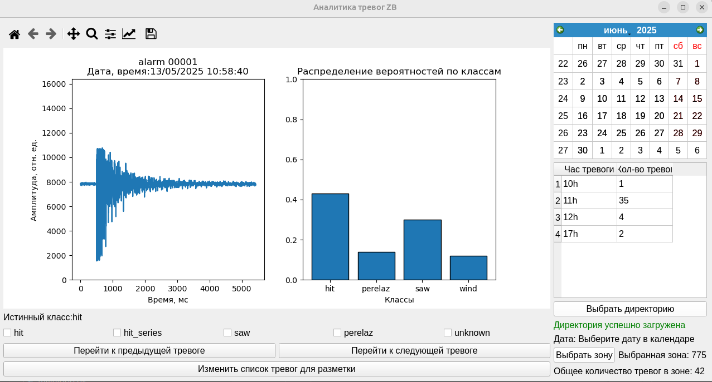

# Установка необходимых пакетов

Для корректного запуска всех программ рекомендуется создать conda окружение в соответствии с файлом environment.yml

Если miniconda не установлена, на linux ubuntu можно установить при помощи терминала в одну инструкцию:
```bash
curl -O https://repo.anaconda.com/miniconda/Miniconda3-latest-Linux-x86_64.sh
sh Miniconda3-latest-Linux-x86_64.sh
```

Далее для создания виртуального окружения нужно выполнить в терминале:

```bash
conda env create -f environment.yml
```

Для активации виртуального окружения в терминале:
```bash
conda activate ZB
```
  
# Описание файлов в директории 

В данной директории содержатся следующие папки:

1) scripts - папка со скриптами, необходимыми для работы системы
2) notebooks - здесь хранятся  .ipynb (jupiter notebooks) для исследовании, экспериментов, обучения моделей.
3) objects - здесь хранятся папки с проектами отдельных проектов (например в папке demostend хранится полный набор для запуске на демостенде)
4) models - сохраненные обученные модели
5) content - хранилище со вспомогательными изображениями, видео для презентаций 

# Описание процесса классификации

Основные цели разработанной системы классификации:

1) Постоянное получение данных с интерферометра
2) Детектирование факта воздействия на забор
3) Выдача метки классификации

Ниже приведена визуальная схема того как система работает на данный момент


Система (за исключением data receiver и data sender) представляет из себя последовательно идущие модули (которые могут быть заменены при желании). Модули оформлены в виде классов. Для более подробного ознакомления смотреть код (необходимые комментарии оставлены)

## Data receiver
Для получения данных с интерферометра на данный момент используется чтение из буффера ввода. В буффер данные попадают через backend Кирилла. Поэтому на данный момент data receiver не оформлен в виде отдельного класса. Для получения данных достаточно в бесконечном цикле читать данные из буфера. Данные будут приходить по 1000 значений в секунду.

## Detector
В первую секунду работы системы детектор получает 1000 отсчетов по которым считает СКО. Посчитанное значение выступает в качестве опорного значения шума устройства. Значение threshold означает: во сколько раз необходимо превысить шум прибора чтобы тревога поднялась (detect выдал True)? (например threshold = 2 -> в два раза)

## Cropper
Cropper работает в связке с детектором. В одну секунду приходит 1000 значений (один фрейм). Детектор на этот фрейм выдает True/False. В случае если зафиксирована тревога (детектор вернул True), то отсчитывается отступ от начала воздействия, начинается запись сигнала пока продолжается тревога. Запись прекращается в двух случаях: 
1) превышено максимальное время записи устанавливаемое пользователем (по умолчанию 10 секунд. В этом случае система не будет дожидаться окончания воздействия (например длинного перелаза или долгого ветра), а будет выдавать метку классификации через 10 секунд.)
2) тревога не поднимается в течении времени охлаждения (например в случае короткого удара только один первый фрейм вызовет True у детектора, последующие фреймы поднимут False, поэтому запись закончится по времени охлаждения)

## Preprocessor
Preprocessor получает от Cropper обрезанный сигнал и выдает данные в формате, необходимом для модели. В нынешней конфигурации классификатора одной из составляющих является tsfresh extract_features для перевода временных рядов переменной длительности в табличное представление (путем вычисления различных статистических признаков из сигнала). Так как extract_features требует [определенный формат данных на входе](https://tsfresh.readthedocs.io/en/latest/text/data_formats.html), то Preprocessor переводит данные, полученные Cropper-ом в формат требуемый extract_features (я назвал этот формат longDataFrame).

В силу того, что:
1)  Сырой сигнал представляет собой колебания вокруг постоянного уровня (который может находится на любом уровне) разной амплитуды (в зависимости от чувствительности интерферометра)
2) Отклонения от постоянного уровня могут быть как биполярными (в обе стороны от постоянного уровня), так и униполярными (только в одну сторону от постоянного уровня)
3) Статистические признаки, извлекаемые tsfresh.extract_features напрямую из сырого, неотфильтрованного сигнала, получаются довольно неустойчивыми (информацию о воздействии несет скорее огибающая сигнала а не сам сигнал от вибраций)

Использование только сырого сигнала не привело к хорошим показателям качества классификатора. Поэтому извлекать признаки не только из сырого сигнала, а извлекать определенные признаки (описанные в preprocessing.py) из:
* сырого сигнала.
* сигнала, отфильтрованного скользящим средним (несет информациб о низкочастотной составляющей).
* сигнала, отфильтрованного скользящим СКО (несет информацию о высокочастотной составляющей).
* спекта Фурье, сгруппированного по частотам (при анализе сигналов было выявлено, что больше информации несут низкочастотные участки спекта, поэтому поверх фурье-спектра используется усредняющее окно с меняющимся размером: при малых частотах это окно мало, потом экспоненциально увеличивается).

  Сырой сигнал, Отфильтрованные сигналы (скользящее среднее, скользящее СКО) лежат в одном longDataFrame.
  Фурье-спектр сигнала лежит в другом датафрейме: longFreqDataFrame. 

## Classifier
Классификатор представлен в виде [sklearn-pipeline](https://scikit-learn.org/stable/modules/generated/sklearn.pipeline.Pipeline.html), также рекомендуется изучить способ интеграции tsfresh и sklearn-pipeline [ссылка к изучению](https://tsfresh.readthedocs.io/en/latest/text/sklearn_transformers.html). Код представлен в notebook_v3.ipynb в папке notebooks. Вообще задание структуры классификатора, его обучение и сохранение происходит внутри jupiter notebook. При желании можно заменить классификатор на свой (в этом случае, если остальные части системы оставлять неизменными, нужно будет отредактировать класс Classifier в classifier.py: переопределить нужным образом инициализацию классификатора, метод predict)

### Описание нынешней версии классификатора

Ниже приведена схема прохода данных через классификатор


Данные, после прохождения через Preprocessing, представляют собой два dataframe: longDataFrame (с сигналами во временной области), longFreqDataFrame (с сигналом в частотной области). Для каждого датафрейма происходит извлечение своих признаков (список извлекаемых признаков описан в Preprocessing.py) Затем происходит конкатенация полученных признаков в одну таблицу: это и есть табличное представление сигнала. После того как сигнал преобразован в табличное представление, можно использовать алгоритмы классического машинного обучения для решения задачи многоклассовой классификации. Для данной задачи был выбран класификатор RandomForest (Случайный лес) 

Обоснование выбора модели:
Boosting или Bagging? (Два основных претендента на высокое качество работы для данных этой природы)
1) В условиях зашумленных признаков (сильный удар может быть похож на перелаз, перепил. Перепил по характеристикам может быть похож на перелаз) случайный лес показывает хорошее качество и работает лучше чем градиентный бустинг.
2) В режиме реального времени требуется быстрое предсказание (Случайный лес может быть распараллелен, бустинг - последовательный алгоритм, распараллелен быть не может)
3) Интерпретация: Отдельные деревья в случайном лесе легче интерпретируются, для бустинга процесс интерпретации сложнее.

## Data Sender
Выход классификатора должен быть согласован с Sender.
На данный момент передача метки классификации происходит в стандартный поток вывода (в консоль), оттуда классификация идет дальше в систему отображения outpost zb.

# Сохранение и просмотр тревог.

Во время работы классификатора имеется возможность включить авто сохранение тревог. При сохранении тревоги записывается:
 * сигнал, который привел к тревоге
 * дата, время тревоги
 * json-строка с вероятностями по классам.

Сохранение тревог в таком формате преследует две цели:
   1) Автоматический набор данных для дальнейшего обучения модели
   2) Проверка корректности работы классификатора

Объект отвечающий за сохранение тревог, представляет собой класс Saver внутри скрипта scripts/saver.py

Ниже приведена файловая структура сохранения тревог:

## Файловая структура при сохранении тревоги (пример)

- ./data/  
  - /610/
    - /2025_05_13/  
      - /05h
        - 610_2025_05_13_05_00_00_000.hdf5
      - /06h
        - 610_2025_05_13_06_00_00_000.hdf5
      - /13h
        - 610_2025_05_13_13_00_00_000.hdf5 
      - /23h 
        - 610_2025_05_13_23_00_00_000.hdf5  
    - /2025_05_15/
      - /08h
        - 610_2025_05_15_08_00_00_000.hdf5   
  - /775/
    - /2025_05_13/ 
      - /14h
        - 775_2025_05_13_14_00_00_000.hdf5
    ...

  - marker.txt


Такая вложенная файловая структура для хранения тревог позволяет сохранять в отдельные файлы тревоги отдельных зон, дней, часов и при повреждении какого-то файла будет утеряна информация за один час.

Название hdf5 файла содержит всю информацию о зоне, дате, часе сработки (эта избыточность информации в названии файла обуcловлена историческими требованиями отдела ОРПО). hdf5 файл содержит в себе датасеты (один датасет - одна тревога) у каждого датасета есть аттрибуты: "date_time" (дата и время тревоги), "probabilities" (строка-json с класами и соответствующими вероятностями)

## Графический интерфейс для просмотра тревог

>[!warning] 1) Нельзя использовать GUI для просмотра тревог, в "работающей" директории (то есть когда классификатор записывает в просматриваемую директорию новые тревоги). Это может привести к аварийному вылету приложения. 2) Вылеты приложения скорее всего означают нарушение файловой структруры при сохранении или пустое содержимое hdf5 файлов. Поэтому вручную лучше не трогать вложенные директории. 
p.s. Данный интерфейс создан для удобства разметки и просмотра тревог и не проходил полную отладку на всевозможные баги, при аварийных завершениях рекомендуется перезапустить интерфейс

Для удобного просмотра сработок алгоритма, назначения тревогам меток можно использовать скрипт GUI_viewer.py (работает только для просмотра тревог, хранящихся во вложенной структуре, описанной выше (класс Saver обеспечивает сохранение в таком формате)). 

```bash
conda activate ZB
python3 scripts/GUI_viewer.py
```

Ниже представлен скриншот интерфейса для просмотра/разметки тревог:


После запуска приложения нужно:
1) Нажать кнопку выбрать директорию (выделена зеленым цветом на панели справа)
2) В появившемся меню выбрать путь до папки в которой лежит хранилище со вложенной структурой(подсказка: там лежат папки с зонами)
3) Нажать на зеленую кнопку "выбрать зону"справа внизу, выбрать в появившемся меню номер нужной зоны
4) Далее можно перемещаться по тревогам для просмотра. Для этого можно использовать: календарь для перехода на конкретную дату, кнопки "Перейти к следующей тревоге", "Перейти к предыдущей тревоге" для переключения между ближайшими по времени тревогами. При переходе на новое воздействие отображается: сигнал который привел к срабатыванию алгоритма (после cropper), в соседнем окне справа появляются вероятности классов которые выдал классификатор при срабатывании.
5) Если нужно перейти в режим разметки, то нужно нажать на кнопку "Изменить список тревог для разметки" (нижняя большая кнопка).
6) В появившемся меню появится список названий классов для разметки (с новой строки новое название). По умолчанию уже установлен стандартный набор: hit, hit_series, saw, perelaz, unknown (одиночный удар, серия ударов, перепил, перелаз, неизвестное воздействие). Если нужно добавить свои классы, то нужно написать их в таком же формате
7) После выбора меток для разметки появится опция выбора истинной метки для сигнала. При выборе воздействия у соответствующего hdf5 меняется (или создается если отсутствует) аттрибут label на тот что вы выбрали.

Демонстрация работы в GUI (видео):
[Демонстрация работы интерфейса (MP4)](content/demoGUI.mp4)


    